# 🩺 Health Chatbot App (Flutter + Gemini API)

This is a Flutter-based Health Chatbot App that integrates the **Google Gemini API** for AI-powered health conversations. It features **local login using SQLite**, displays user-specific projects, and allows **profile updates**.

---

## 🚀 Features

- 🔐 **User Login with SQLite**
    - Secure local authentication
    - Stores user credentials and session data locally

- 🤖 **Health Chatbot using Gemini API**
    - Powered by Google’s Gemini AI
    - Engages users in health-related conversations
    - Context-aware and natural replies

- 📁 **Project Display**
    - Shows a list of user-specific health projects
    - Clean UI with Flutter widgets

- 🧑‍💼 **Profile Update Feature**
    - Update personal info like avatar, name,Gender,Dob and preferences
    - Saved directly to local SQLite storage

---

## 🛠 Tech Stack

| Tech             | Usage                     |
|------------------|---------------------------|
| Flutter          | UI & Logic                |
| SQLite (sqflite) | Local login and storage   |
| Gemini API       | Chatbot AI                |
| GetX             | (if used) State management|

---

## 🖥️ Screens (Optional)
- Login Screen
- Home Screen
- Chatbot Screen
- Profile Page

---

## App UI Preview

### 🔹 Splash Screen
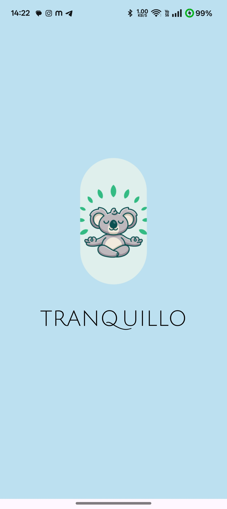

### 🔹 First Screen
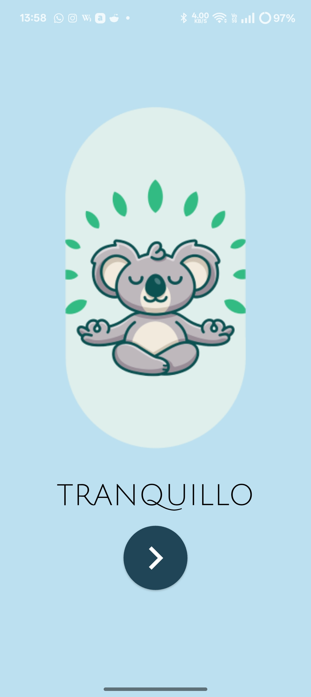

### 🔹 Login Screen
 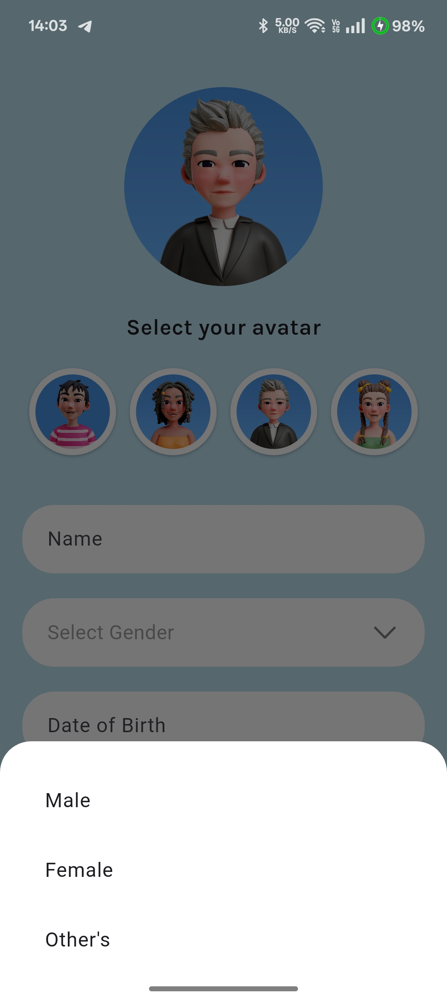 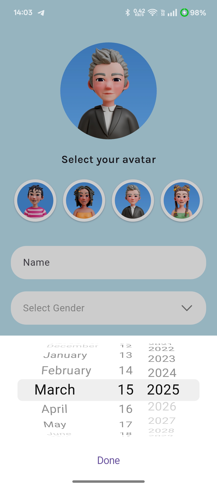

### 🔹 Welcome Screen
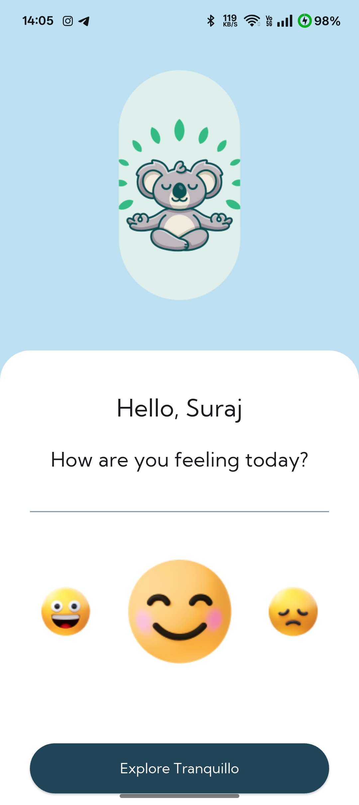

### 🔹 Home Screen
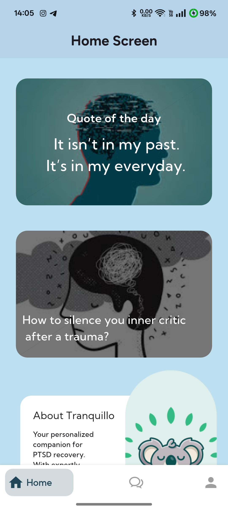

### 🔹 Chat Screen
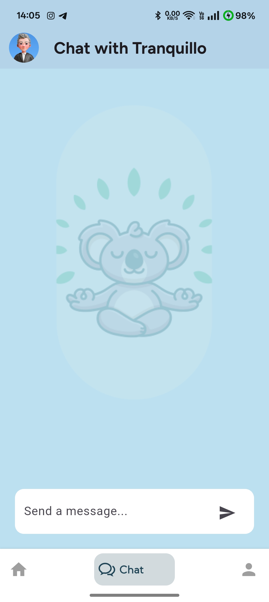

### 🔹 Chat Response Screen
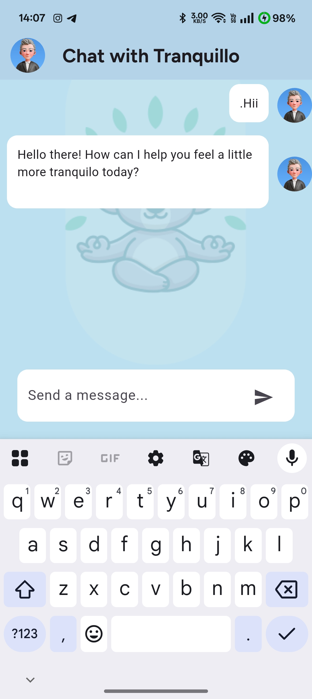 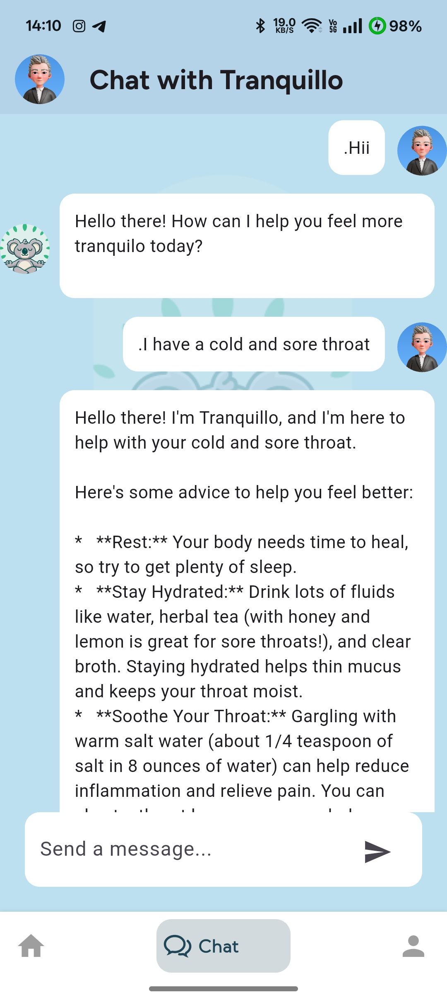

### 🔹 Profile Screen
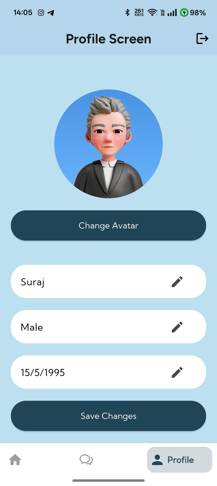  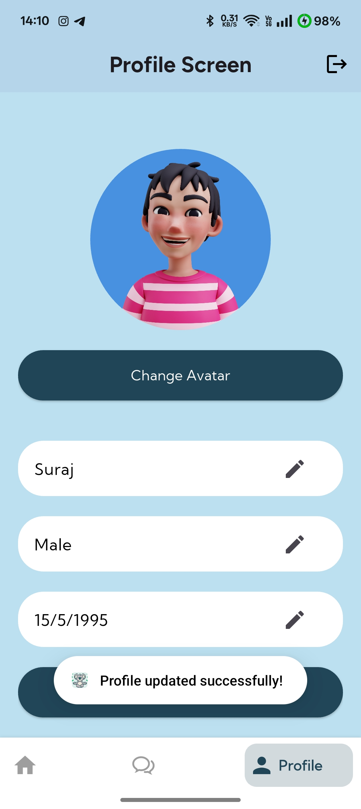

## 📦 Getting Started

### 1. Clone the Repository
```bash
git clone https://github.com/surajsince2003/Chat-Bot.git

